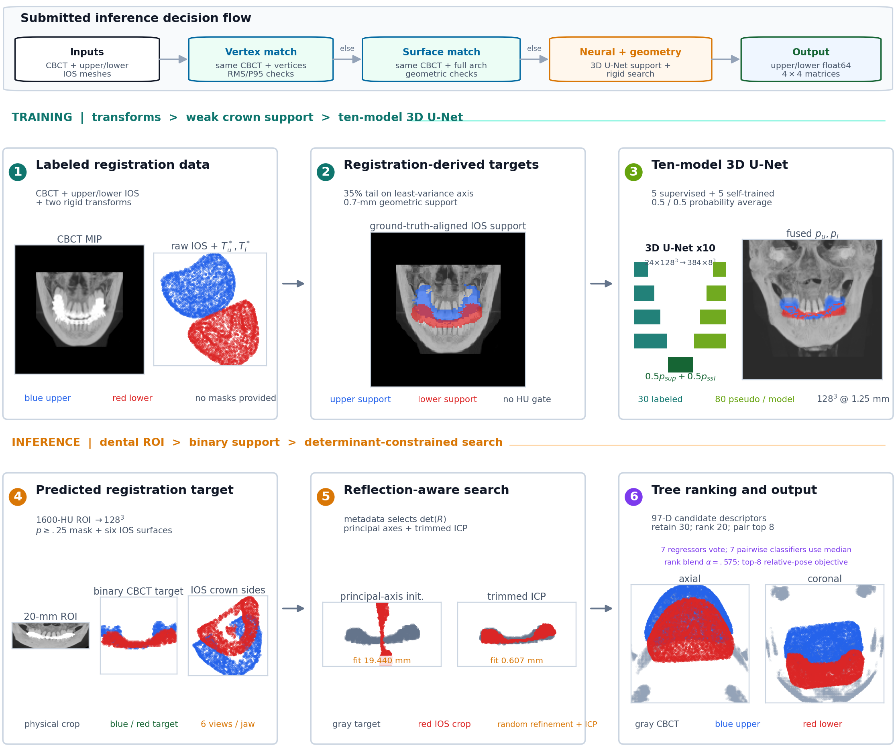

# Registration Teaches Registration

**Transform-Derived Crown Guidance for Semi-Supervised CBCT-IOS Alignment**

Official **1st-place method for STSR 2026 Task 2**, developed by team
`avalanchezy`.

[Chinese documentation](README_zh-CN.md) | [Method](docs/METHOD.md) |
[Implementation map](docs/IMPLEMENTATION_MAP.md) |
[Reproduction](docs/REPRODUCE.md) | [Docker](docs/DOCKER.md)



## Overview

Task 2 provides CBCT volumes, upper/lower IOS meshes, 30 labeled registration
cases, and 300 unlabeled cases. It does **not** provide tooth masks. This method
turns the labeled rigid transforms into weak volumetric supervision: aligned
IOS crown-side surfaces define thin upper/lower support targets in CBCT space.
A semi-supervised 3D U-Net ensemble predicts those supports, after which a
reflection-aware geometric search and learned candidate rankers estimate one
rigid matrix per jaw.

The submitted system has three inference routes:

1. Verified paired-vertex correspondence for an identical CBCT/IOS reference.
2. Verified surface correspondence for an identical CBCT with retessellated IOS.
3. Crown-guided PCA initialization, trimmed multiscale ICP, randomized basin
   refinement, ExtraTrees ranking, and joint upper/lower selection.

No Task 1 masks, ToothSeg weights, external pretrained dental segmentation
model, or external dental dataset were used by the submitted method.

## Results

| Evaluation | Result |
|---|---:|
| Official hidden test | **1st place** |
| Public validation mean translation error | **5.7848 mm** |
| Public validation mean rotation error | **2.8637 deg** |
| Public validation completion | **100 / 100 jaws** |
| Grouped fused crown-support Chamfer | **1.0817 mm** |

The organizer's first-place notice did not include a numerical hidden-test
metric, so the public-validation values are reported separately.

## Installation

Python 3.11 was used for deployment. Install a CUDA-compatible PyTorch build,
then install the project:

```bash
python -m venv .venv
source .venv/bin/activate
python -m pip install --upgrade pip
python -m pip install -e ".[dev]"
```

On Windows PowerShell, activate with `.venv\Scripts\Activate.ps1`.

## Inference

The model assets are not committed because the template banks contain sampled
geometry derived from organizer data. See [Model assets](model_assets/README.md)
and [Reproduction](docs/REPRODUCE.md).

After placing a reproduced or team-authorized asset bundle in `model_assets/`:

```bash
python scripts/verify_assets.py
python scripts/run_submission_inference.py \
  --input-dir /path/to/inputs \
  --output-dir /path/to/outputs \
  --model-dir model_assets
python scripts/validate_outputs.py \
  --input-dir /path/to/inputs \
  --output-dir /path/to/outputs
```

Each input case must contain `CBCT.nii.gz`, `upper.stl`, and `lower.stl`.
Each output case contains finite NumPy `float64 (4,4)` matrices:

```text
outputs/<case_id>/upper_gt.npy
outputs/<case_id>/lower_gt.npy
```

## Reproducing the Winning Configuration

The exact deployed hyperparameters are stored in:

- `configs/training/final_method.json`
- `configs/submission/deployment_policy.json`
- `configs/submission/crown_postprocess.json`
- `configs/submission/crown_ensemble.json`
- `configs/submission/docker_assembly_manifest.json`

The complete staged commands are documented in [docs/REPRODUCE.md](docs/REPRODUCE.md).
The release deliberately separates reproducible source and configuration from
restricted challenge data and data-derived template geometry.

## Docker

With `model_assets/` populated:

```bash
docker build -t registration-teaches-registration:latest .
mkdir -p outputs
docker run --gpus all -m 8G --rm \
  -v "$PWD/test_case_data:/inputs:ro" \
  -v "$PWD/outputs:/outputs:rw" \
  registration-teaches-registration:latest
```

The entrypoint takes no arguments and follows the official STSR container
contract. More details are in [docs/DOCKER.md](docs/DOCKER.md).

## Repository Layout

```text
task2reg/       reusable geometry, data, crown-network, and ranking modules
scripts/        preprocessing, training, evaluation, assembly, and inference
configs/        exact final training and deployment configuration
tests/          geometry, leakage, ranking, transfer, and output-contract tests
docs/           method, data, reproduction, Docker, and release documentation
model_assets/   local-only generated assets; binaries are excluded from Git
```

The exact submitted path and the optional research utilities are separated in
[docs/IMPLEMENTATION_MAP.md](docs/IMPLEMENTATION_MAP.md). Shared runtime files
retain a few disabled experimental modes because they are preserved
byte-for-byte from the submitted container.

## Verification

```bash
python -m pytest -q
python scripts/audit_source_release.py
```

The initial public release passes 126 tests. Runtime source hashes are recorded
in `configs/submission/runtime_source.sha256` to make the link to the submitted
container auditable.

## Data and Model-Asset Policy

The STSR dataset is governed by the organizer's terms and is not redistributed
here. Do not upload CBCT volumes, IOS meshes, ground-truth transforms, template
banks, checkpoints, or private evaluation outputs to this repository. The MIT
license applies to this repository's source code only, not to the challenge
data or organizer materials.

## Citation

The final challenge-paper citation will be added after publication. For now,
use the metadata in `CITATION.cff` and cite the repository URL and release tag.
