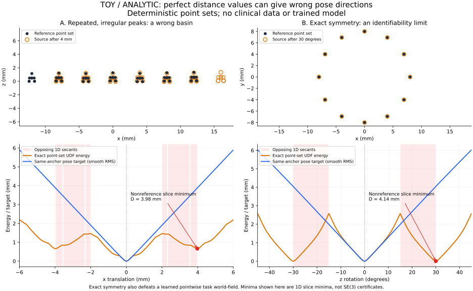

# 方法核心：几何距离与配准势能分离

本轮把重点放回一个可直接检验的科学问题：**为什么距离预测更准确，不一定能让配准优化更正确？** 新方法不增加 backbone，也不需要额外分割、关键点或对应标注。仍使用现有 CBCT、IOS 点、人工刚体变换及候选缓存。

## 1. 单一距离场的问题是什么

设真实 IOS 经参考变换形成表面 \(S^*\)，精确 unsigned distance 为 \(d^*(y)\)。即使网络完全拟合它，聚合能量

\[
E_d(T)=\frac1N\sum_i\rho(d^*(Tx_i))
\]

也不等于固定同点的真实位姿误差。相似牙尖可以匹配到相邻结构，形成错误的低能量区域。把正确/错误候选排序，只约束若干位置的能量高低；它不约束每个错误候选附近该往哪个方向走。

下面是不含任何训练模型的解析例子。左侧是不完全重复的峰形点集：精确点集 UDF 在平移约 3.98 mm 处仍出现错误的一维极小值。右侧是严格对称圆环：旋转 30° 后集合重合，但同点位移约 4.14 mm。



```bash
python scripts/probe_registration_energy_geometry.py \
  --output-dir /tmp/rtr-registration-geometry-probe
```

脚本输出 SVG、PNG 和数值 JSON。图中极小值是一维切片的极小值，不是已证明的六维稳定盆地；比例只描述此玩具，不能外推到牙科患者。

它说明两个不同问题：

1. **目标冲突**：精确距离场已经决定了其配准能量。如果再强迫同一个输出产生与真实位姿误差一致的能量变化，就可能只能牺牲距离准确性。
2. **不可辨识**：若 \(HX=X\)，任何无序逐点标量场聚合都有 \(E(TH)=E(T)\)。增加势能头也不能消除这种完全对称性；必须增加辨别信息或接受多解。

新实现针对第一点，不声称解决第二点。

## 2. 两个输出承担不同任务

原 U-Net 与 query trunk 共享，最后输出：

\[
d_\theta(I,y,j)=\operatorname{softplus}(a_\theta),\qquad
u_\theta(I,y,j)=\operatorname{softplus}(b_\theta).
\]

`d` 是有毫米距离监督的几何输出，用于距离回归、可选 Eikonal、覆盖率和空间伪监督。`u` 是非负任务势能值，**不是到牙面的毫米距离**，通过排名和局部能量变化监督学习。Implicit 只多一个 64→1 线性输出头；dense 也有对应的双输出控制。

配准能量为

\[
E_\theta(T)=\frac1N\sum_i\rho(u_\theta(I,Tx_i,j))
+\lambda_c[1-C(d_\theta,T)]+\lambda_o E_{\rm ROI}(T),
\]

其中 \(\rho(z)=\sqrt{z^2+0.1^2}-0.1\)，覆盖率仍按几何距离计算，ROI 项仍使用物理越界距离。`energy_mode=distance` 时令 `u=d`，严格恢复原单头能量。

这里分离的是两个**输出的目标**。共享特征及几何覆盖项仍传递任务梯度，因此并非两个参数完全隔离的网络。距离精度是否保持，需要与配准改善一起测量。

新任务头从相同距离 checkpoint 的末层复制初始化。升级瞬间两种模型的能量相同；后续差异来自训练，而不是随机更换起点势能。推理仍用原候选缓存及同一局部优化器。

## 3. 直接监督错误候选附近的能量变化

用独立保存的固定 IOS anchors 定义训练目标：

\[
\Psi_\epsilon(T)=
\sqrt{\frac1M\sum_m\|Ta_m-T^*a_m\|^2+\epsilon^2}-\epsilon.
\]

默认 \(\epsilon=1\) mm。该目标是同点 RMS 的平滑版本；最终评价仍报告既有平均同点位移 D。它不需要新增对应标注，因为同一个 IOS 点通过两种刚体变换天然保持身份。

位姿局部坐标采用 \(\eta=(r\omega,v)\)：\(r\) 是当前优化点相对质心的 RMS 半径，下限 1 mm。这样六个轴的探针都是毫米尺度；旋转实际幅度为 \(h/r\) 弧度。以相同中心、相同半径构造正负 SE(3) 扰动 \(T_k^+,T_k^-\)，监督

\[
g^E_k=\frac{E(T_k^+)-E(T_k^-)}{2h},\qquad
g^\Psi_k=\frac{\Psi(T_k^+)-\Psi(T_k^-)}{2h},
\]

\[
\mathcal L_{\rm secant}=\operatorname{Huber}(g^E,g^\Psi).
\]

不仅约束方向，也保留局部变化的幅值。所有探针保持当前 parity；异 parity 的错误候选仍由外层离散选择处理，不要求连续优化完成不可能的镜像翻转。

只约束 GT 处中央差分为零，不能区分极小值、极大值和平台。因此额外匹配参考邻域的正能量差：

\[
\mathcal L_{\rm min}=\operatorname{Huber}\left(
\frac{E(T_k^{*\pm})-E(T^*)}{h},
\frac{\Psi(T_k^{*\pm})}{h}\right).
\]

损失不依赖能量常数偏置。训练使用普通网络反传，不需要对优化器多步展开，也没有 secant 项引入的二阶参数反传。

默认每 jaw 使用最多 2 个同 parity、D 在 0.5–15 mm、当前能量最低的错误缓存候选，以及 2 个参考附近扰动。优先约束“当前模型容易选错”的候选邻域。局部探针 h 默认以 0.5 mm 为中心，在 0.25–1 mm 中按对数均匀抽样，降低固定尺度的周期性混淆。

但有限差分不是微分梯度的保证。例如特定周期的小幅振荡可以保留正确 secant，却改变真正导数。因此实验必须测**实际 autograd 梯度与真实优化器结果**；不能仅用训练 loss 下降证明成功。

## 4. 可直接运行的核心对照

先沿既有接口准备数据并训练一个共同的 C2 checkpoint，见[训练手册](JOURNAL_TRAINING_zh-CN.md)。所有下列第二阶段从它开始，使用相同 manifest、seed、epoch、优化器和候选预算：

| 配置 | 改变 | 回答的问题 |
| --- | --- | --- |
| `m1_distance_rank.json` | 单头距离 + 排序 | 共同 continuation 对照 |
| `m2_distance_unroll.json` | M1 + 两步展开 pose loss | 已有直接终点监督能否解决问题 |
| `m3_distance_secant.json` | M1 + 局部 secant/minimum | 单头目标冲突是否在数据上出现 |
| `m4_task_secant.json` | 分离任务势能 + 排序 + secant/minimum | 主要方法 |
| `m5_task_rank.json` | 分离任务势能 + 排序 | 收益是否仅来自增加输出自由度 |
| `m6_task_secant_no_cached.json` | M4 用 4 个 GT 扰动替换缓存错误候选 | 真实错误盆地是否比随机扰动更有价值 |

```bash
python scripts/train_registration_field.py \
  --manifest /data/journal/experiment/manifest.json \
  --config configs/journal/m4_task_secant.json \
  --initialize-field /data/runs/c2_seed0/best.pt \
  --output-dir /data/runs/m4_seed0 --seed 20261002
```

其他组只换 config/output-dir，保持共同父 checkpoint。可先全部 `--epochs 10` 检查训练信号，再按同一预算正式运行；继续同一配置时 `--resume .../last.pt`。三个 seed 分别用其对应的共同父模型，不混用 teacher 种子。

M1–M6 都按实际精修后重选的患者平均 D 选择 checkpoint，默认 20 步、4096 点。正式训练前测这一验证成本。M6 的计划监督起点数与 M4 相同；若某病例没有足够合格缓存候选，实际 M4 数目可能更少，日志 `secant_cached_used` 会显示。应报告实际计算量，不把相同 epoch 直接叫相同 FLOPs。

默认 secant 部分每个监督起点需要 25 次势能评估，4 个起点最多 100 次；共享一次 encoder，512 个查询点，候选查询分块。没有二阶反传不等于必然更快或更省显存，要与两步展开实际测量。`secant_points`、`secant_cached_candidates`、`secant_reference_perturbations` 可用于显存/成本试验，但正式对照须记录一致设置。

## 5. 怎样判断这个方法是否值得写论文

先看监督部分，暂不让 SSL 混淆归因。用现有真实候选跑最终配准；再用以下机制实验看变化发生在哪里：

```bash
python scripts/benchmark_journal_landscape.py \
  --manifest /data/journal/experiment/manifest.json --split val \
  --checkpoint rank=/data/runs/m1_seed0/best.pt \
  --checkpoint single_secant=/data/runs/m3_seed0/best.pt \
  --checkpoint task_secant=/data/runs/m4_seed0/best.pt \
  --rotation-degrees 0 5 10 20 --translation-mm 0 1 2 4 8 \
  --repeats 5 --refinement-steps 20 --point-budget 4096 \
  --output-dir /data/experiments/method_landscape
```

重点看最终 D、同起点改善/恶化、capture range、选择 regret，以及几何距离误差。实际初始梯度方向与位姿误差的对齐程度用于解释机制；最终优化结果才是方法是否有用的直接证据。围绕参考构造的起点是机制实验，实际候选启动是主结果，两者应分别报告。

以下结果会直接削弱或推翻方法假设：M4 不优于 M3；M5 已获得 M4 全部收益；secant 更好但实际梯度/收敛不变；M6 与 M4 一样或更好；配准改善完全依赖几何距离精度严重下降。不要用新增模块数量解释这些负结果。

监督增益成立后，再用已有 C5/C6 空间伪监督扩展；用 `ablate_field_pseudo_weights.py` 在同一 accepted transforms 上做正权重均匀/空间对照。这样 SSL 是独立的第二个问题，不是掩盖监督方法失败的补丁。

## 6. 与已有方法的关系

[SDFReg](https://arxiv.org/abs/2304.08929)已有隐式距离函数配准。[Gao 等的 MICCAI 2020 工作](https://arxiv.org/abs/2003.10987)已用位姿梯度监督学习有利于优化的相似性函数。因此不把“距离场”“梯度监督”“能量塑形”本身声明为首次。

本分支要验证的具体贡献是：CBCT–IOS 中几何距离与任务能量目标的分离、来自真实错误候选的物理局部约束，以及这两点对同预算配准优化的作用。代码已使这些主张可以直接比较；尚无真实数据结果证明它们成立或达到 KBS/MedIA 录用标准。
