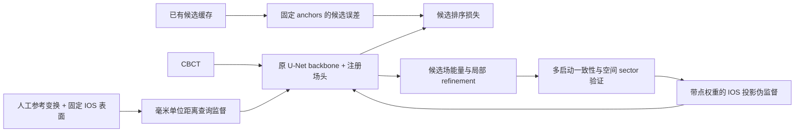

# RTR 期刊扩展：研究问题、实际方法与实验协议

本分支将原有配准系统扩展为可训练的连续注册场、候选排序监督和配准验证空间自训练。**交付的是研究实现和可复现实验入口；真实病例上的精度提升、外部泛化和临床价值尚待另一台训练机器验证。** 原始提交路径与新研究模块分开保存，不能把软件测试通过写成方法已经优于旧系统。

用户提供的反思报告是研究建议。本文件根据实际代码作出取舍，不把报告中的数据规模、计算预算、未核实论文信息或建议阈值转写成事实。环境安装、数据转换与训练命令见同目录的训练文档；这里规定研究问题、损失含义、公平比较和论文证据边界。

## 1. 面向 KBS，核心问题应该是什么

建议把论文问题表述为：**有限标注条件下，怎样把任务层面的几何知识转化为表示学习的监督，使该表示更有利于选择和修正配准？** 真实变换提供空间监督，错误候选提供判别监督，多次求解的差异提供局部可信度。这条主线能够把研究从一个牙科应用系统推进到任务监督与决策可靠性的方法研究。

这是对投稿适配性的判断，不是接受保证。真正决定扩刊质量的是新方法是否带来可归因的收益，以及能否排除数据重复、额外监督、训练预算和参考标准偏差。建议暂用工作题目：

> **Optimization-Aware Continuous Registration Fields with Verified Self-Training for CBCT–IOS Alignment**

如果 ranking 有效而 verified SSL 无明确收益，就应缩小题目和贡献范围。如果连续场只提高自身重建指标、没有改善配准，也不能用“optimization-aware”代替实验证据。

投稿前应由作者查看 [KBS 官方主页](https://www.sciencedirect.com/journal/knowledge-based-systems)及其当前作者指南。本次环境访问官方主页返回 HTTP 403，因此这里不引用未经读取的投稿政策、新内容比例、版面限制或录用标准。

两个已核对的相关工作足以划清最基本的创新边界：

- [SDFReg](https://arxiv.org/abs/2304.08929) 已研究以神经隐式函数进行点云配准。因此不能声称首次用距离场或隐式表示做 registration。
- [PREDATOR 官方实现](https://github.com/prs-eth/OverlapPredator) 对应低重叠点云配准，提供 overlap/matchability 相关建模与评估流程。因此不能把学习重叠区域本身当作独占创新。

拟检验的新贡献应限定在：**CBCT 条件化的变换派生场，如何由困难刚体候选及优化行为塑造；可信配准如何转化为带空间权重的新增监督。** 本分支没有复现上述外部方法，也没有验证用户报告中其他近期方法的完整实现与数据情况。

## 2. 与旧系统相比，实际改变了什么

原方法详见 [METHOD.md](METHOD.md) 和 [IMPLEMENTATION_MAP.md](IMPLEMENTATION_MAP.md)。原提交网络学习 background/upper/lower 三类弱 crown support，部署搜索主要使用后处理后的二值 mask，并通过既有几何搜索和候选排序获得变换。

新模块在 [task2reg/journal/](../task2reg/journal/) 中实现以下路径：

为了得到清晰的归因，保留原五层 U-Net 的计算结构；新模型通过等价显式 forward 取得 decoder1/2/3 特征。旧网络代码和权重接口保持独立。新增头、损失与查询方式应作为实验因素，而不是同时替换 backbone、增加多个 ensemble，再把所有收益归给 field。

当前新推理路径对**缓存候选**评分和细化；它不是一个已经替代所有旧候选生成步骤的端到端系统。当前输出也没有直接接入旧的已拟合 97 维 ExtraTrees 模型。若后续加入 field features 并重新训练 ranker，必须另做 OOF 训练和控制实验，不能把新特征塞入旧模型后声称完整复现。

## 3. 坐标、表面与注册场

### 3.1 坐标契约

每个变换满足

\[
T=\begin{bmatrix}R&t\\0&1\end{bmatrix},\qquad y=Rx+t,
\]

其中 \(x\) 是 IOS 坐标，\(y\) 是 CBCT 物理坐标，长度单位统一为 mm。允许 \(R\in O(3)\)，包括导出协议产生的 \(\det R=-1\)；不能先把这些矩阵当作损坏标签修成正旋转。

体积张量保持 NIfTI 数组顺序 `[B,C,I,J,K]`。查询使用完整 affine：

\[
q=A^{-1}[y^T,1]^T.
\]

因此支持平移、旋转、各向异性和斜切 affine。不能把世界坐标直接当作数组索引，也不能仅用 spacing/origin 忽略方向。新实现是显式八顶点采样，没有依赖 `grid_sample` 的轴排列约定。若以后替换成 `grid_sample`，必须重新核对其坐标最后一维与数组 `I,J,K` 的对应关系。

当前训练只做强度扰动。不要直接复用旧分割训练的数组 flip/rot90，除非同时正确更新 affine、查询、变换和候选；否则 mask 训练看似正常，物理点监督却已经错位。

### 3.2 表面定义与参考距离

对于一个 jaw 的固定 IOS 支持点集 \(X\) 和人工参考 \(T^*\)：

\[
S^*=T^*X,\qquad d^*(y)=\min_{s\in S^*}\|y-s\|_2,
\qquad \widetilde d^*(y)=\min(d^*(y),d_{\max}).
\]

默认 \(d_{\max}=8\) mm。开放 crown 表面没有可靠的 inside/outside 定义，因此这里使用截断**无符号**距离。KD-tree 的目标是到保存的有限表面点集的距离，是对连续 mesh 表面距离的采样近似；不能把采样误差忽略为零。

预处理接受固定上游 crown 点集；其选择过程应与当前病例 GT 无关，并在训练和推理保持一致。若未提供，适配器使用完整 IOS 面积采样并记录 `surface_definition=full_ios`、给出提示。这样可以运行数据转换，但它属于 full-IOS 控制，**不等同于 crown-only 主实验**。固定 crown 输入的定义应在主要训练前冻结。

评价 anchors 从完整 IOS 三角面按面积采样，使用独立的固定随机序列保存。不要把密集顶点区当作更重要的解剖区，也不要为每个方法重新抽一批评价点。

### 3.3 Dense 和 implicit 两种实现

| 模式 | 实际实现 | 需要验证的差异 |
| --- | --- | --- |
| `dense` | decoder1 接两通道距离头，softplus 后做三线性查询 | 稠密预测作为直接工程基线 |
| `implicit` | decoder1/2/3 分别投影为 16 通道，在查询位置采样；拼接 3 维 ROI 归一化坐标和 8 维 jaw embedding；MLP 为 59→128→128→64→1，SiLU 与 softplus | 多尺度查询解码是否改善误差、梯度和优化 basin |

两种表示在查询位置都可以连续变化；**三线性 dense TUDF 也是连续函数**。Implicit 的动机是可学习的多尺度查询解码，不能把“只有 implicit 连续”写成贡献。预测值通过 softplus 保持非负；代码并没有把预测输出硬截断到 8 mm，截断作用于训练 target。

显式插值形式为

\[
h(y)=\sum_{c\in\{0,1\}^3}w_c(q)\,H[i_c,j_c,k_c].
\]

使用 gather 和八个可微权重，以支持坐标梯度及训练 refinement 所需的高阶反传。多尺度特征采用与输入网格端点对齐的范围约定，单例维度单独处理。插值在体素边界处是分段光滑，不能宣称处处二阶光滑。

## 4. 实际优化目标

本节对应 [field.py](../task2reg/journal/field.py) 与 [engine.py](../task2reg/journal/engine.py)。参数是初始研究配置，不是已在真实数据证明最佳的设置。

### 4.1 空间查询与距离重建

当前抽样比例为表面 20%、近表面 40%、缓存候选变换点 15%、外围扰动 15%、ROI 均匀点约 10%；整数取整余量进入均匀部分。没有候选时，候选部分退回近表面扰动。近表面高斯标准差为 \(\min(1,d_{\max}/3)\) mm，外围高斯标准差为 \(d_{\max}\)。这不是报告中的多尺度 \(\sigma\) 混合采样，后者尚未作为默认实现。

距离重建为加权 Huber：

\[
L_f=\frac{\sum_q w_q H_{\delta}(\hat d_q-\widetilde d_q^*)}
{\max(\sum_qw_q,10^{-12})},\qquad
w_q=(0.1+e^{-\widetilde d_q^*/2})\,w_q^{\text{spatial}},
\]

\[
H_\delta(r)=
\begin{cases}
\tfrac12r^2,&|r|\le\delta,\\
\delta(|r|-\tfrac12\delta),&|r|>\delta.
\end{cases}
\qquad \delta=1\text{ mm}.
\]

人工监督通常取空间权重 1；可信伪标签使用后述点权重。零权重区域不提供场监督。

有原 weak support 标签时，保留 weighted CE + foreground soft Dice 辅助损失 \(L_s\)，背景 CE 权重使用旧损失函数默认值 0.05。Support 不是完整牙齿解剖分割的人工标签；论文中应保持这一名称和监督来源。

### 4.2 用于评分和细化的场能量

对固定 IOS 点集 \(X\)，定义

\[
E(T)=\frac1N\sum_i\left(\sqrt{F(I,Tx_i,j)^2+\epsilon^2}-\epsilon\right)
+\lambda_c(1-C(T))+\lambda_o\frac1N\sum_i o(Tx_i),
\]

\[
C(T)=\frac1N\sum_i\sigma\left(\frac{2-F(I,Tx_i,j)}{0.25}\right).
\]

默认 \(\epsilon=0.1\) mm、\(\lambda_c=1\)、\(\lambda_o=2\)。每个候选使用相同点集；不允许因为 crop 更小而获得天然更低能量。

\(o(y)\) 是点与 voxel-box clamp 后位置之间的物理位移范数，零点有微小数值平滑。对旋转的各向异性网格，它对应盒外距离；存在 shear 时，它是 clamp 位移的物理范数，未实现平行六面体的精确最近点投影。场查询的边界特征不能代替越界惩罚，否则体外点可能形成错误低能量。

这里 soft coverage 与伪标签 gate 的 hard coverage 不是同一指标；gate 使用距离不超过 2 mm 且点位于 ROI 内的比例。

### 4.3 候选排序监督

在保存的固定完整 IOS anchors \(\{a_m\}\) 上计算

\[
D(T,T^*)=\frac1M\sum_m\|Ta_m-T^*a_m\|_2.
\]

这同时反映旋转和平移造成的物理误差，并避免直接比较 translation 参数导致的原点依赖。若 \(D_b-D_a>0.5\) mm，才构造“a 应优于 b”的有序对：

\[
L_r=\operatorname{mean}_{(a,b)}
\operatorname{softplus}\left(\frac{E(T_a)-E(T_b)+m_{ab}}{0.25}\right),
\qquad
m_{ab}=\operatorname{clip}(0.1(D_b-D_a),0.1,1.0).
\]

当前代码按 `0–0.5 / 0.5–2 / 2–5 / 5–15 / ≥15 mm` 分桶抽候选，再使用全部满足 gap 的有序对；训练时可加入精确参考作为正例。验证和推理不注入 GT 候选。当前实现没有声称按旧 ExtraTrees 的误判强度完成更复杂的 hard-negative mining。

默认 `rank_weight=0.25`，前 20 epochs warmup，随后 10 epochs 线性增加排序权重。必须保持实验配置记录；不能用含有变化中损失权重的训练 loss 作为各 epoch 的可比注册性能。

### 4.4 保持 parity 的局部优化

每次更新在当前变换后 IOS 中心 \(c\) 周围进行：

\[
T_{t+1}=C_c\exp(\widehat\xi_t)C_c^{-1}T_t,
\]

其中 \(\xi\) 前三维为旋转弧度、后三维为平移 mm，使用矩阵指数避免零旋转附近的除零高阶梯度问题。角度梯度由 crown 平均平方半径归一化；单步旋转和平移上限分别为 0.1 rad、1 mm。

增量始终属于 SE(3)，所以 \(\det R\) 的正负保留。该优化无法修正初始化选错的 parity：应把 parity 当作候选生成的离散假设，而不是期待连续梯度越过它。

推理 refinement 使用六档步长回溯，找不到更低能量就保留原矩阵。训练的 `differentiable=True` 分支采用固定步长和同样的步幅限制，保留高阶梯度，**不保证每一步能量下降**。训练展开和推理优化不能当作完全相同的算法描述。

可选 pose loss 为两步细化后的固定 anchor 误差：

\[
L_p=D(T_2,T^*).
\]

可选 Eikonal 项仅使用 \(0.5<d^*<3\) mm 的 query：

\[
L_g=\operatorname{mean}(\|\nabla_yF(I,y,j)\|_2-1)^2.
\]

**当前默认 `eikonal_weight=0`、`pose_weight=0`。** `pose_steps=2` 只是启用 pose loss 后的展开步数。应在 field + ranking 初步有效后分别打开两者；不能把可配置但未启用的损失写成所有主实验都使用。

总损失按实际启用项组成：

\[
L=\lambda_sL_s+\lambda_fL_f+\lambda_r(t)L_r+\lambda_gL_g+\lambda_pL_p.
\]

推荐先使用 \(\lambda_s=\lambda_f=1\)，其他默认值如上。伪病例不把 pseudo transform 当成人工真值用于 rank 或 pose loss。

## 5. 配准验证的空间自训练

### 5.1 当前实现是冻结 teacher 的分轮自训练

先训练监督 teacher，再固定 checkpoint，生成伪监督，最后训练 student。可以重复分轮，但本分支不要求 EMA teacher，也没有把“已实现 EMA”作为贡献。每一轮保存 teacher 标识、运行参数和拒绝原因。

对无标签病例，从原始缓存候选开始，循环留出几何 sector：仅用保留点给初始化评分、选择和优化；加入小幅姿态扰动和点采样变化。在这些轨迹完成后，才做完整点集的候选细化以检查不同 basin 的歧义。

Sector 是第一 PCA 轴投影上的等点数连续分组，默认四组。它不是牙齿分割或解剖编号。默认开发设置为八次启动；若改变 sector 或启动数，应保持所有方法的比较预算一致。

**Heldout 的严格边界：它没有参与本次 field 候选选择和 refinement，但上游缓存候选可能已使用完整 IOS 做 PCA/ICP。** 因而当前结果应称“留出 sector 的 refinement 一致性”，不能称整个配准流水线的独立交叉验证。更严格的实验需要为每个 sector 重新生成未见该 sector 的候选，或者从与该点集拟合无关的固定假设开始。Teacher 自身产生的 field 残差也不是独立真值证据。

### 5.2 选择实际 medoid，而不是平均矩阵

对多次结果 \(T^{(b)}\)，使用固定 anchors 定义两变换距离 \(D(T_a,T_b)\)，取总距离最小的实际输入矩阵作为 \(T_{\text{med}}\)。不直接平均 4×4 矩阵。

点的空间不确定性为

\[
u(x)=\sqrt{\frac1B\sum_b\|T^{(b)}x-T_{\text{med}}x\|_2^2}.
\]

U50/U95/max 是 anchors 上这些 RMS 不确定性的统计量，不是单独 translation 或 rotation 的方差。它自然反映同一旋转扰动对不同牙弓位置的不同影响。

初始 gate 设置如下，均需要在开发集校准后冻结：

| 检查 | 当前默认阈值 |
| --- | --- |
| U50 / U95 / 最大 anchor RMS 位移 | ≤0.5 / ≤1 / ≤2 mm |
| parity 一致比例 | 100% |
| 全局 / 每个 sector 的 hard coverage@2 mm | ≥0.85 / ≥0.65 |
| heldout 距离 median / P90 | ≤0.75 / ≤1.5 mm |
| ROI 外比例 | <0.05 |
| 不同 basin 的分隔 | 固定 anchor 平均位移 >2 mm |
| 不同 basin 的相对能量 gap | 不小于 0.1 |

不同 basin 检查遍历完整候选池，不能只比较排序前两行，因为两个重复最优候选可能掩盖第三个远处的近等能量解。还要核对 medoid 没有落入一个明显更差的远处 basin。缺失/非有限证据、无法形成有效监督的零权重集合均应拒绝。

### 5.3 空间权重如何进入监督

当前点权重为

\[
w_u(x)=\exp\left[-\frac{u(x)^2}{2(0.75)^2}\right].
\]

超过 1.5 mm 不确定性或位于 ROI 外的点置零；病例被拒绝时整例置零。当前实现没有额外训练一个 uncertainty 网络，也没有实现报告中连续乘上 \(w_{\text{held}}w_{\text{coverage}}\) 的版本；heldout 和 coverage 作为接受 gate。

接受后将真实 IOS 点经 \(T_{\text{med}}\) 投影成伪表面，重新计算距离 query，而非直接把 CBCT teacher 输出当成场 target。每个 query 继承最近伪表面点的权重；默认只在距伪表面 2 mm 的监督半径内提供损失，远处未知区域忽略。保存的是表面点、变换和点权重，训练时再抽样 query。

空间加权机制的增益必须通过相同预算实验证明。多次优化可能稳定地得到同一个错误解，低方差不是正确性的充分条件。建议额外运行错配 CBCT–IOS、错误 parity、重复牙面及局部缺失等负控制。

## 6. 数据和参考标准协议

### 6.1 先冻结身份，再划分

使用显式 source、全局协调后的 patient_id、case_id、jaw 和 split。相同患者的上下颌、重导出、重新网格化 IOS、重复扫描和内容重复不能跨训练/验证/测试边界。哈希只检测相同内容，不能替代患者身份整理；近重复病例仍需要元数据或人工核查。

至少一个完整来源应锁为 `external_test`，不参与模型拟合、伪标签生成、阈值设定、candidate mining 或选择超参数。随机拆分多来源样本只能证明混合来源的患者泛化，不能替代 source-external 验证。数据规模由真实 manifest 统计，不采用反思报告中的估计总病例数。

候选为 learned 时，缓存必须声明模型来源及排除患者；使用学习过的 support、旋转 prior 或 proposal 都不能写成 `geometry_only`。同样审计 pseudo teacher 和初始化权重。把学过全部人工 GT 的旧 final checkpoint 用于新划分的初始化，会泄漏验证监督，即使后续 fine-tuning 没有再读取验证标签。

元数据只能使声明可检查，不能证明上游确实遵守了声明。训练机器上应保存模型训练名单、候选生成配置、内容 hash 和 checkpoint hash，以便查证。

### 6.2 人工 reference 与自动 reference 分开

核心监督使用人工参考变换；自动分割/传统配准生成的变换称 `silver` 或自动参考，不能自动升级为 GT。自动参考只适合在质量检查后用于独立报告的评价；本分支核心训练不接纳 silver 标签。

若未来使用外部牙齿分割或已训练 IOS 网络构建参考：

- 固定该 pipeline，明确其额外监督与预训练数据；不能与 transform-only 主方法混为同等监督。
- 整颌任务的最终参考必须仍是每颌一个刚体变换。单牙局部修正用于检查 IOS stitching distortion，不能拼成一个并不存在的全局刚体真值。
- 先在有人工参考的开发病例验证，并与人工重标注误差比较；不能只用 ICP residual/Chamfer 证明参考正确。
- 外部主评价应包含盲法人工核验及独立仲裁，且覆盖自动流程拒绝的困难病例，避免仅评价容易病例。

临床标注质量、观察者差异、数据使用许可和对重复病例的人工核查都尚需团队在真实数据上完成。本分支没有生成临床标注，也不提供已经校准的安全阈值。

## 7. 六组核心实验与必要对照

在相同 implicit 架构上执行以下六组，分别拆开候选监督与无标签策略：

| 组 | 人工病例 field | Rank loss | 无标签监督 |
| --- | --- | --- | --- |
| C1 | ✓ | 关闭 | 无 |
| C2 | ✓ | 开启 | 无 |
| C3 | ✓ | 关闭 | 历史 confidence/support 伪标签 |
| C4 | ✓ | 开启 | 历史 confidence/support 伪标签 |
| C5 | ✓ | 关闭 | 注册验证 + 空间加权伪 field |
| C6 | ✓ | 开启 | 注册验证 + 空间加权伪 field |

`ssl_strategy=legacy_support` 的伪病例**只贡献 support CE/Dice**，不把分割 mask 虚构成已知跨模态 transform 或 field target。`ssl_strategy=verified_field` 的伪病例贡献几何距离监督和空间权重，不把未知区域补成背景。人工病例仍按各组设定使用 field/rank。这是对两种 SSL 机制的实际比较，而不是给同一套伪标签换名字。

C6 是预定完整组合，不是事先认定的赢家。建议固定共同的 teacher 生成用于机制比较的伪数据，再另做每组自身 teacher 的完整系统比较；两者不能在同一表中混淆。若 C5 与 C6 各自使用不同质量 teacher，应同时报告该事实和相同 teacher 的控制结果。

除六组外，还必须准备：

| 对照 | 目的与状态 |
| --- | --- |
| RTR-Challenge | 历史提交系统背景；保留其 reference routes 的独立说明，不用其同源复用优势冒充外部泛化 |
| RTR-General | 关闭 reference-bank/同 CBCT 变换复用，使用同患者排除协议；需要在训练机器上实际运行 |
| 受控 binary-support 基线 | 与 field 组匹配 backbone、数据、步数和候选预算，区分表示本身的收益；需要实际运行 |
| Dense TUDF | 与 implicit 相同训练协议，检验查询解码的价值 |
| 几何/对应点基线 | 选定可复现方法并统一数据、监督与指标；外部方法适配尚未完成 |
| 外部分割辅助整颌配准 | 如采用，单独记录外部 tooth/landmark/预训练监督，不混入主方法的标签预算 |

不要把“代码里有入口”“外部仓库提供权重”写成已获得 baseline 结果。所有外部方法需要记录版本、适配差异、训练资源和失败病例；不能将论文原数据上的数字直接并入本研究测试表。

### 7.1 预算控制

主机制比较使用相同数量的伪病例。若 verified gate 仅接受 \(n\) 例，旧 confidence 方法也取 \(n\) 例进行 matched-budget 比较，再单独报告 all-accepted 结果。病例计数应使用 `(source,case_id)`，保留同病例可用 jaws；若数据只有单颌，需明确口径，不能称为完整 paired-case 队列。

同时固定 labeled/pseudo 比例、伪损失总权重、optimizer updates、seed、候选数、候选点数、refinement 次数和计算预算。相同 epoch 数在不同伪病例数下并不代表相同训练量，应核对日志中的 global step。当前训练配置允许选择预算，不能自动替研究者保证任意两份 manifest 的训练步数相等。

六组主表如果采用“监督 teacher 预训练 + 学生阶段”，C1/C2 也必须从相同 teacher
继续相同学生阶段步数，使用 supervised/rank continuation 配置。不能把只有 teacher
训练预算的 C1/C2 与多训练一阶段的 C3–C6 直接比较并归因于 SSL。

主要对比建议三个固定 seed；架构探索可先用单 seed。确定配置后再运行三 seed 主结果，不要根据测试集挑一个最好的 seed。有限开发集上的阈值搜索、停止条件和主假设应提前登记。

### 7.2 必须拆开的消融

建议按价值排序：dense/implicit；rank on/off；inference refinement 0/1/2/4 或固定实际部署步数；Eikonal on/off；两步 pose supervision on/off；consensus-only/加 holdout/加 spatial weights；错误配对负控制。

首先通过小规模 pilot 找出真正改变配准的因素，再扩大训练。没有必要在每个消融中复制历史十模型 ensemble；如果最后使用 ensemble，另表报告单模型结果及额外预算。

## 8. 模型选择、评价和统计

### 8.1 固定验证指标

默认 `validation_metric=selected_D_mm`：对固定验证候选与固定抽样点，用当前 field 能量选最低候选，再在保存的 anchors 上计算 \(D\)，病例结果先在患者内平均、再对患者平均。验证候选不加 GT，也不随 rank warmup 改变评价目标。

**此验证指标目前不包含每个 epoch 的候选 refinement。** 它衡量固定缓存池中的选择质量。最终测试另行运行规定步数的 refinement 并报告 before/after。若研究者决定按 refinement 后性能选 checkpoint，需要在开发阶段建立相应固定协议，不得在看过测试结果后改变选择规则。

`field_loss` 主要用于架构开发或烟雾测试；若用于正式 checkpoint 选择，应说明它与最终注册目标不同。历史 checkpoint 键名可能仍含 `validation_loss`，以同步保存的 `validation_metric` 理解单位。

### 8.2 先区分候选不足还是选择错误

对同一候选池 \(\mathcal C\)：

\[
D_{\mathrm{oracle}}=\min_{T\in\mathcal C}D(T,T^*),\qquad
D_{\mathrm{selected}}=D(T_{\hat k},T^*),\qquad
R=D_{\mathrm{selected}}-D_{\mathrm{oracle}}.
\]

初始和细化后的候选必须一一对应。分别报告 oracle、selected、regret，以及选定候选自身 refinement 前后位移变化；若最终选择变了，不能把“换了候选”和“同一候选被修正”混在一起。

| 观察 | 优先行动 |
| --- | --- |
| 初始 oracle 已差 | 改善 support、初始化或 basin；继续加 ranker 难以挽救候选缺失 |
| Oracle 好、selected 差 | 检验候选排序监督和场能量是否降低 regret |
| 内部两者都好、外部差 | 检查 source shift、重复病例、表面定义、SSL 与参考标准 |

### 8.3 指标命名与失败

主要 \(D\) 是同一组物理 anchors 在预测/参考变换下的平均位移。它不是独立人工解剖 landmark 的 TRE；后者需要独立标注对应点。最近邻 Chamfer 可以补充描述表面贴合，不能替代同点位移。

同时报告 \(D>1/2/3\) mm 的比例、无效/缺失输出率及 parity mismatch。Parity 错误即使由于接近平面的 IOS 使 \(D\) 很小，也属于独立注册失败。只有预测与 reference parity 相同时才计算相对 SO(3) 旋转角。

报告临床安全性还需要专门依据；不能直接把 1、2 或 3 mm 的算法阈值叫作临床安全阈值。也不能把“输出矩阵合法”写成“所有病例配准成功”。

### 8.4 配对比较与 bootstrap

bootstrap 单位为患者，使上下颌和重复扫描一起重采样。配对方法必须使用同病例、同 reference 和同一批 anchors。主要效应报告

\[
\Delta D=D_{\mathrm{new}}-D_{\mathrm{baseline}}
\]

与患者 bootstrap 95% CI，并保留失败病例。当前平均误差统计以有效输出为条件，无效输出率和注册失败率另报，不能删除失败样本后只展示均值。

每个来源单独运行评价并报告，再给总结果。当前基本汇总采用患者 bootstrap，不应把它描述为已实现所有来源分层、scanner 分层和多重比较校正。对于主稿的源分层置信区间、Holm 校正等，应按预注册统计计划追加真实分析。

Risk–coverage 曲线中的 score 是未校准排序指标，不是正确概率。报告覆盖率的单位是病例/jaw记录还是患者，并对同分值造成的排序不确定性作敏感性检查。建议同时展示错误 CDF、oracle-selected 散点、初始误差与收敛率、伪标签 U95 与真实 \(D\)、各来源失败类型。

## 9. 推进顺序和停止标准

| 阶段 | 先交付的证据 | Go / No-Go |
| --- | --- | --- |
| A：数据和旧系统诊断 | 身份清单、无重复划分、固定 anchors、RTR-General 候选 oracle/selected | 坐标/身份/参考仍不清楚时不开始大规模训练 |
| B：Dense + implicit pilot | 相同初始候选下的场误差、真实 \(D\)、refinement 成败分布 | 仅 field loss 好而注册无改善时，停止继续增加复杂度 |
| C：候选判别学习 | C1/C2、regret、固定预算的收敛 basin | 候选质量相当时 selected 改善，才能支持 ranking 贡献 |
| D：SSL 机制 | C3–C6 matched-budget、伪标签接受/拒绝与误差 | Verified SSL 在相同步数/数量下无收益时，不将其作为标题核心 |
| E：锁定外部评价 | 冻结模型/阈值、人工审计参考、困难病例、三 seed | 若外部结果不支持泛化，调整科学结论，不重新用外部数据调阈值 |
| F：论文与发布 | 运行配置、模型来源、完整失败分析、贡献差异说明 | 只有真实完成的结果进入摘要/主表 |

每阶段先运行少量真实病例测显存、运行时 P50/P90 和缓存成本，再决定更大训练规模。GPU 时数与所需存储应从实际记录更新；本文件不把报告中的估算当作本分支已测性能。

## 10. 可以写什么，还缺什么

| 拟写的主张 | 当前状态 | 还需要的证据 |
| --- | --- | --- |
| 实现 CBCT 条件化 unsigned field 查询 | 已有 dense/implicit 代码和坐标/梯度测试 | 实际数据的训练稳定性、误差与泛化 |
| 支持候选排序监督 | 已有损失、候选误差和分桶抽样 | C1/C2 与三个 seed 的 selected/regret 比较 |
| 支持保持 parity 的局部优化 | 已有解析场、原点不变性和高阶反传测试 | 真病例 basin、成功率、代价及失败案例 |
| 支持注册验证空间伪监督 | 已有 gate、medoid、权重与导出路径 | 接受精度、拒绝病例审查、matched-budget SSL、负控制 |
| 优于原 RTR-General | 尚未证明 | 同划分、同候选/计算预算下的真实比较 |
| 跨来源泛化更好 | 尚未证明 | 完全锁定来源、无训练重叠和独立参考 |
| 临床可靠或节省人工时间 | 尚未证明 | 双读者核验、观察者差异、修正时间和临床评价方案 |
| 适合并可被 KBS 接受 | 研究方向判断，无法保证 | 实质新增、充分实验、当前投稿要求核对和同行评审 |

论文应主动说明与原 challenge 工作的关系，列出新增表示、监督、验证和实验内容；不以代码行数或随意的新内容百分比代替实质扩展。软件当前能检验的是“方法如何运行”，后续真实实验必须回答“为什么有效、何时失败、能否推广”。
